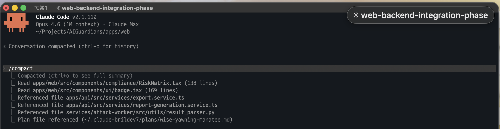
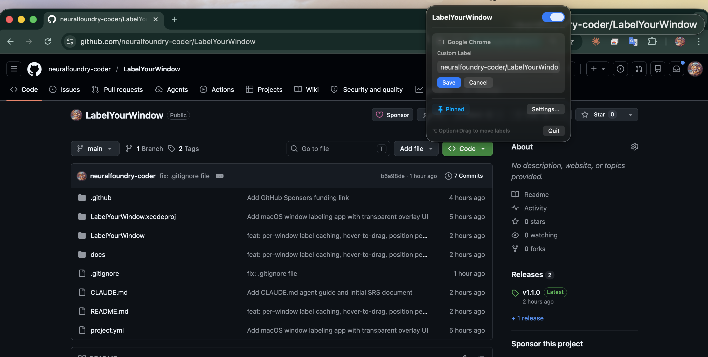
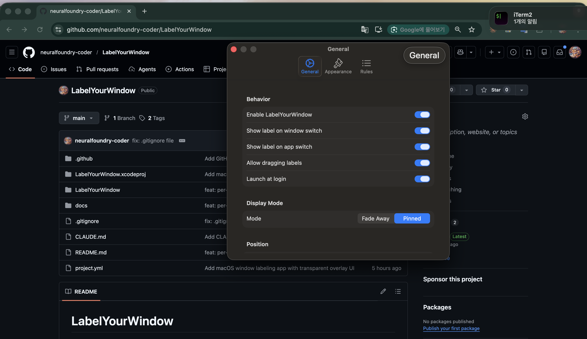

# LabelYourWindow





A minimal macOS menu bar app that displays translucent label overlays on your windows, so you always know what each window is for.

Built for **macOS 15+** (Sequoia) on **Apple Silicon**.

## Features

- **Auto Label Detection** - Reads window titles via Accessibility API and parses them into meaningful labels (browsers, editors, terminals, and more)
- **Translucent Glass Overlay** - Behind-window blur effect with minimal text-based design
- **Fade Away / Pinned Modes** - Labels appear on window switch and fade out, or stay pinned
- **Drag to Reposition** - Hover over any label and drag to move it
- **Custom Labels** - Edit labels directly from the menu bar popover
- **Rule Engine** - Define regex-based rules to auto-label windows by app name, title, or bundle ID
- **Full Settings UI** - Customize font, opacity, position, duration, corner radius, and more

## Install

1. Download the `.dmg` or `.zip` from the [latest release](https://github.com/neuralfoundry-coder/LabelYourWindow/releases/latest)
2. Move `LabelYourWindow.app` to `/Applications`
3. Launch the app
4. Grant **Accessibility** permission in System Settings > Privacy & Security > Accessibility

## Build from Source

Requires Xcode 16+ and [XcodeGen](https://github.com/yonaskolb/XcodeGen).

```sh
brew install xcodegen
xcodegen generate
xcodebuild -scheme LabelYourWindow -configuration Release -arch arm64 build
```

## Usage

| Action | How |
|---|---|
| Toggle on/off | Click menu bar icon > toggle switch |
| Edit label | Click menu bar icon > Edit Label |
| Switch mode | Click menu bar icon > Pinned / Fade Away |
| Move label | Hover over label + drag |
| Open settings | Click menu bar icon > Settings... |
| Add auto-rule | Settings > Rules tab > `+` button |

## Settings

- **General** - Enable/disable, display mode, fade duration, label position, launch at login
- **Appearance** - Font size/weight, glass effect toggle, background opacity, corner radius
- **Rules** - Pattern-based auto-labeling with regex support and priority ordering

## Architecture

```
WindowObserver (AX events)
    → LabelManager (manual > rule > auto)
    → OverlayManager (NSPanel overlay + animation)
```

- Event-driven via `AXObserver` — no polling, minimal CPU usage
- `CGWindowListCopyWindowInfo` fallback for apps with restricted AX access
- `NSPanel` with `.nonactivatingPanel` for overlays that never steal focus

## Requirements

- macOS 15.0+ (Sequoia)
- Apple Silicon (arm64)
- Accessibility permission

## License

MIT
